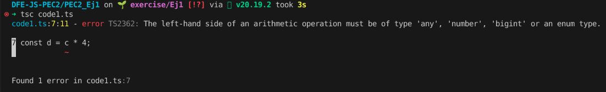

# Error inducido

Se ha modificado la linea 7, eliminando la propiedad del objeto __c__ en el producto.

Se produce el error porque __c__ no es del tipo permitido por la operación. En cambio, tanto apple como banana (propiedades del __c__) si que son del tipo permitido (_number_), por eso antes de la modificación no aparecía el error.

TypeScript añade una capa de robustez a JavaScript, haciendo comprobaciones estrictas de tipo antes de ejecutar código. Evitando errores surgidos por cambios dinámicos de tipos que puede hacer JavaScript.

# Preguntas teóricas

1. Para cada uno de los valores del fichero code2.ts, ¿Qué tipo de datos inferirá TypeScript? Explica por qué se ha inferido este tipo de datos.

    a: number literal

    b: string literal

    c: string literal

    d: boolean[]

    e: { type: string }

    f: (number|boolean)[]

    g: number[]
    
    h: null literal

2. ¿Por qué se dispara cada uno de los errores del fichero code3.ts?
    
    `i = 4;` Falla porque `i` es una constante y no puede modificarse su valor. Debería declararse `let i: number = 3;` (hacer mutable y de tipo `number`) para poder cambiar el valor de `i` a 4.

    `j.push('5');` Falla porque `j` es una array de números. Eso significa que los únicos tipos que puede puede contener son `number`. Y aunque sea constante eso sólo impide la reasignación del a variable, no bloquea el cambiar ni forma de la array ni cambiar el valor de sus elementos.

    `let k: never = 4;` Falla porque al tipo `never` no se le puede asignar ningún valor, sea del tipo que sea. Debería declararse `let k: number = 4;` para poder asignar ese el valor de `i`.

    `let m = l * 2;` Falla porque al multiplicar `l` este todavía no tiene un tipo definido ya que se le ha especificado que sea `unknown`. Para poder operar deberíamos hacer `let m = (l as number) * 2`, asegurandonos que `l` en ese punto se va a comportar como un número.

3. ¿Cuál es la diferencia entre una clase y una interface en TypeScript?
    
    Las clases crean objetos que continene propiedades y métodos que funcionan en tiempo de ejecución, mientras que las interfaces únicamente definen la estructura de un objeto (sirven de plantilla), pero no se ejecuta ni se instancia nada. 

    La interfaz es una herramienta que ofrece TS para ayudarnos a mejorar la legibilidad y estructura del código. Pero, una vez se transpila a JS, no se genera código, simplemente desaparece.

